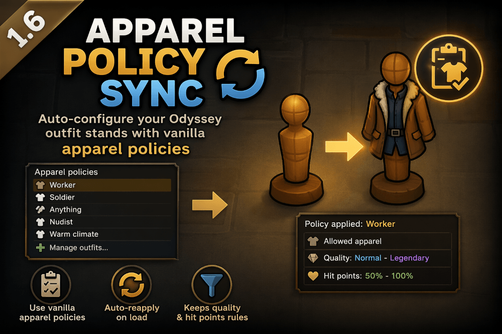

# Wardrobe Policy Sync

**RimWorld 1.6 – Odyssey DLC**

Automatically configure Odyssey outfit stands using vanilla apparel policies.

---

## ✨ Features

* Apply any vanilla **Apparel Policy** directly to an outfit stand
* Automatically syncs on game load
* Applies:

  * Allowed apparel
  * Quality settings
  * Hit points (durability)
* Manual controls:

  * Apply policy
  * Reapply policy
  * Clear policy

---

## 🧠 How it works

Instead of manually configuring each outfit stand:

1. Select an outfit stand
2. Click **"Apply apparel policy"**
3. Choose an existing vanilla policy

👉 The stand will now follow that policy automatically.

---

## 🔄 Auto Sync

When loading a save:

* The assigned policy is re-applied automatically
* Keeps your wardrobe consistent with your colony rules

---

## ⚠️ Notes

* If a policy is renamed, it may not be found again (based on label matching)
* Only affects **Odyssey outfit stands**
* Does not modify pawn behavior directly

---

## 🧩 Requirements

* RimWorld 1.6
* Odyssey DLC
* Harmony (auto-loaded dependency)

---

## 🌍 Languages

* English (default)
* French (included)

---

## 🛠️ Development

This mod is open source.

Feel free to contribute or suggest improvements.

---

## 📦 Version

**V1.1**

* Initial release
* Apparel policy integration
* Auto-sync on load
* Quality & durability support

---

## ❤️ Credits

Created by **Diablood**

---

## 📷 Preview

